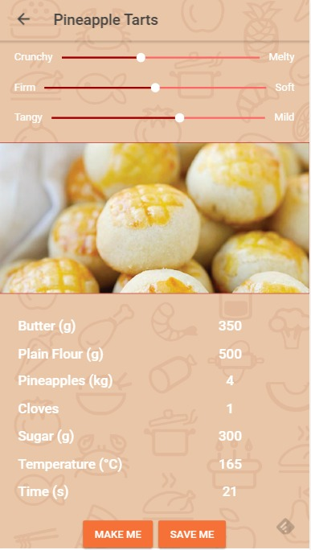
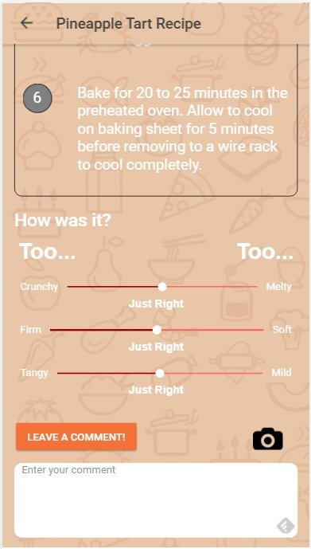

Recipedia
=====================

Top 5 entry for [Startup Weekend 2017](http://www.up.co/communities/singapore/singapore/startup-weekend/10354). 

Recipedia is an application that finds recipes for food exactly the way you want it. Making use of currently available recipes, recipedia builds a database and ranks them in terms of attributes (crispy, soft etc.) based on user reviews. It normalizes the reviews to account for the difference in tastes of different users.

When you want to find a recipe, you can choose how you would like your food based on certain attributes. Recipedia then finds the closest recipe to your requirements and also shows you what changes were made, allowing you to understand what differences in the recipe accounts for the different tastes. 

The algorithm to match a recipe to your required attributes uses the closest point in a n-dimensional cartesian coordinate space. Mapping each recipe based on its attribute into a n-dimensional cartesian graph, it matches a recipe to your input by finding the closest recipe in terms of distance in the graph.

Recipedia also learns from you over time, accounting for your tastes and normalizing based on your reviews.

